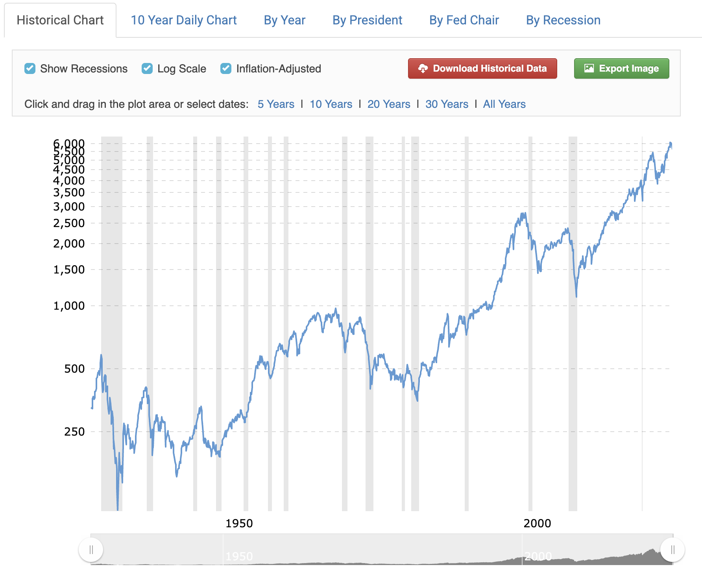
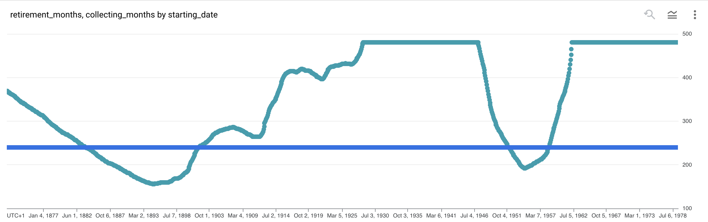

# Adatelemzés - S&P 500 mint nyugdíjmegtakarítás
Több elemzés olvasható az S&P 500 indexről és az ezt követő ETF-ek befektetési célú használatáról. Ilyen elemzésekben gyakori, hogy egy adott vásárlási dátumhoz és egy adott eladási dátumhoz kötve számolnak ki visszavetített éves hozamot, illetve hasonló személetben nézik a lehetséges veszteségeket is. Szintén szokás egy nagyon tág intervallumra nézve (például a múlt évszázad) kiszámolni az éves hozamot.

Én szerettem volna egy olyan forgatókönyv szerint megvizsgálni a historikus adatokat, amelyben 20 évig minden hónapban, nyugdíjcélból befizetek egy adott összeget, majd nyugdíjas éveimben havonta veszek ki belőle. Erős feltételezés, de úgy építettem fel a számítást, hogy 20 évig annyit fizetek be minden hónapban, amennyit nyugdíjasként majd ki szeretnék venni, és ezt minden hónapban ki is veszem. A vizsgált kimenetel tehát nem a megtakarítási időszak végén elért hozam lesz, hiszen a felhasználási időszakban is még lesz bent pénzem. Inkább azt vizsgáltam, hogy hány hónapig tart ki a nyugdíjas éveimben a megtakarítás.

Az egészet inflációval korrigált adatokon nézem. Ez persze feltételezi, hogy a befizetéseimet is az inflációval növelem majd, és nyugdíjasként is egyre többet veszek majd ki - ahogy a megélhetési költségek is növekednek.

Viszonyításként, a lenti grafikon az elmúlt 90 év, inflációval korrigált index-értékei. A konkrét adatokat egy másik forrásból vettem, ahol 1870-től kezdődnek az adatok, a linket lásd lent.

Az adatelemzésem eredményét pedig az alábbi grafikon mutatja:

A kék egyenes vonal a megtakarítási hónapok száma, fixen 240, tehát 20 év. A görbe azt mutatja minden hónapra, hogy ha abban a hónapban kezdem a megtakarítást, akkor hány hónapig fog kitartani a nyugdíjas éveimben. 480 hónapnál, tehát 40 évnél vettem rajta egy maximumot. A grafikon jobb oldala csalóka lehet, mert 1963-tól kezdve a 20+40 év már 2023-ba ér, ahol vége az adatsornak, így nem elemezhető ki pontosan, hogy meddig tart majd ki. Az elemzést itt a teljes nyugdíjidőszak átlagárán adja el a maradék indexet, és ebből becsül még hátralevő hónapokat - ez most minden esetben több, mint 480 hónapos nyugdíjidőszakot becsül, de persze ha a közeljövőben nagyon beesik az index, akkor ez lehet kevesebb, de 2023-ig biztosan kitart.

Megfigyelések:
* A legrosszabbul azok jártak, akik 1894-ben kezdték a megtakarítást, és pont az első világháború kezdetekor mentek nyugdíjba. Ők is még 156 hónapig azért kitartottak, a befektetéseik 35%-át veszítették el a teljes időtartam alatt.
* Hasonlóan rosszul járt az, aki 1954-ben kezdett megtakarítani, és 1974-től ment nyugdíjba. A legrosszabb esetben neki 192 hónapig tartott ki a pénze, és 20%-ot veszített.
* Nagyon jól jártak, akik még a két világháború között kezdték a megtakarítást, de már az 50-es évekbe csúsztak a nyugdíjas éveik. Nekik gyakorlatilag nem fogyott el a pénzük.

Természetesen egy ilyen megtakarítási forgatókönyv tényleges megvalósítása még sok más költséggel és kockázattal jár.

Lenne értelme akár az adott kezdőhónapokhoz tartozó értékekhez visszaszámolni, hogy ez mekkora éves hozamú, egyenletesen kamatozó befektetéssel lenne egyenértékű, de ezeket az adatokat már nem tettem most mellé. Érdekesség volt számomra, hogy 20 évnyi megtakarítás mellett kb (infláció feletti) 3.5% fölött már egy olyan helyzet alakul ki, ahol a befektetés minden hónapban a kamataiból kitermeli a havi kifizetést.

Hogy ebből az elemzésből milyen következtetések vonhatók le? Hát ez jó kérdés :)

## Hivatkozások
 * Az elemzéshez használt adatok forrása https://datahub.io/core/s-and-p-500
 * A grafikon forrása: https://www.macrotrends.net/2324/sp-500-historical-chart-data
